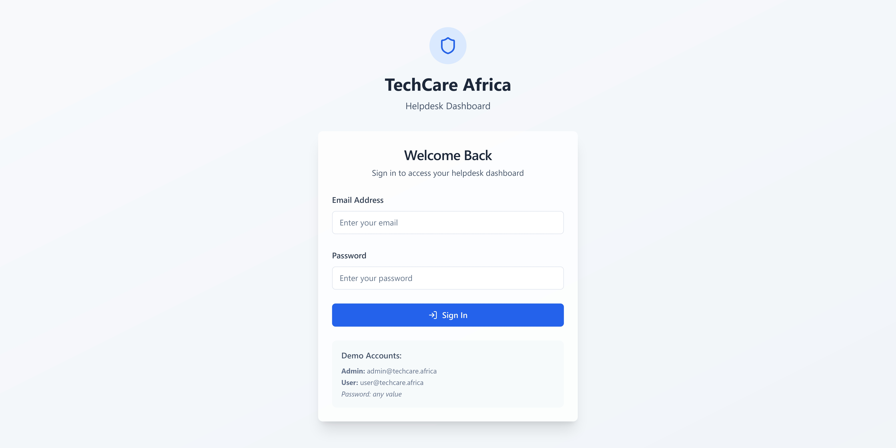
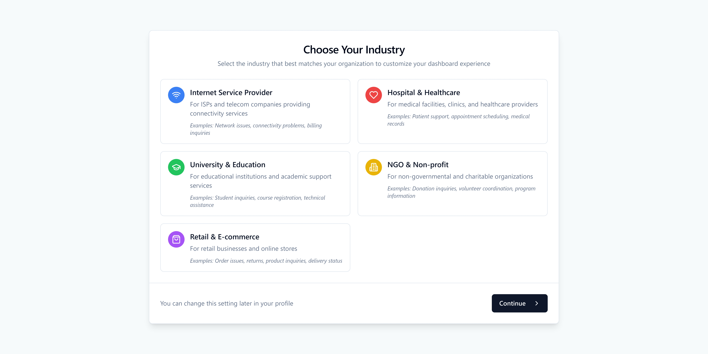
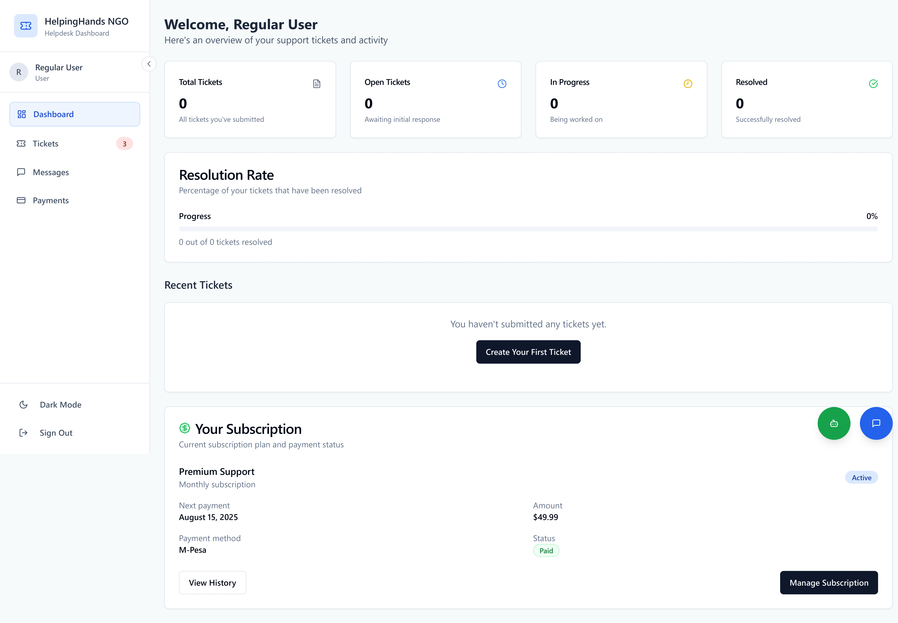
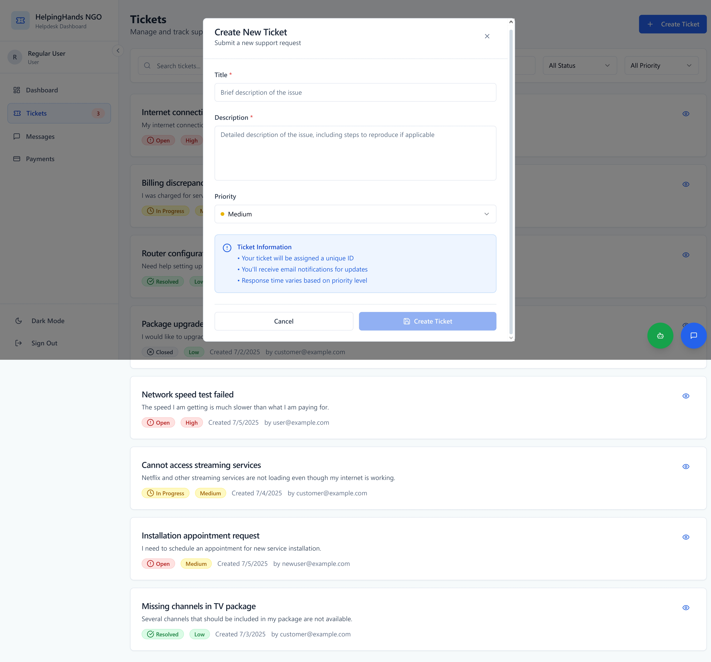
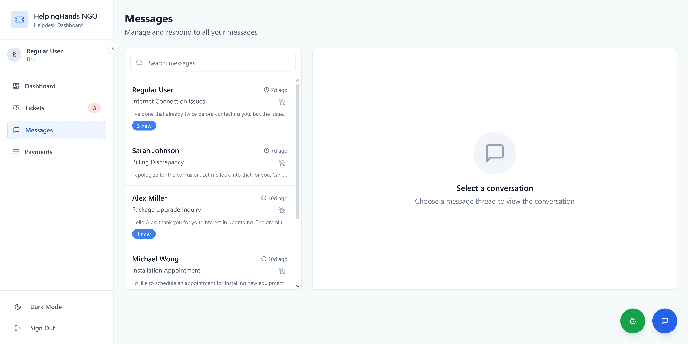
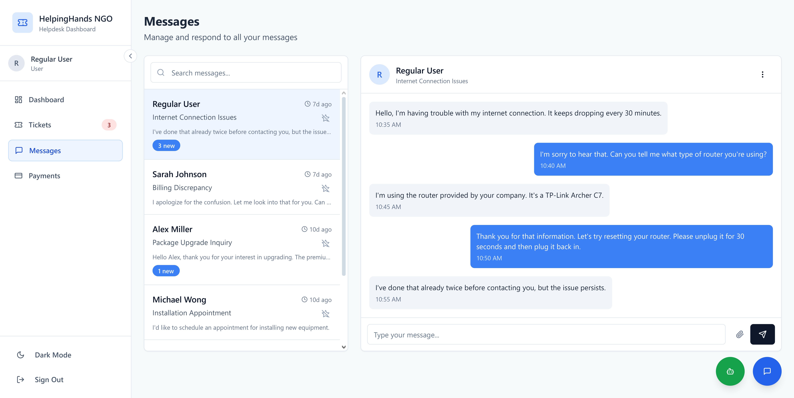
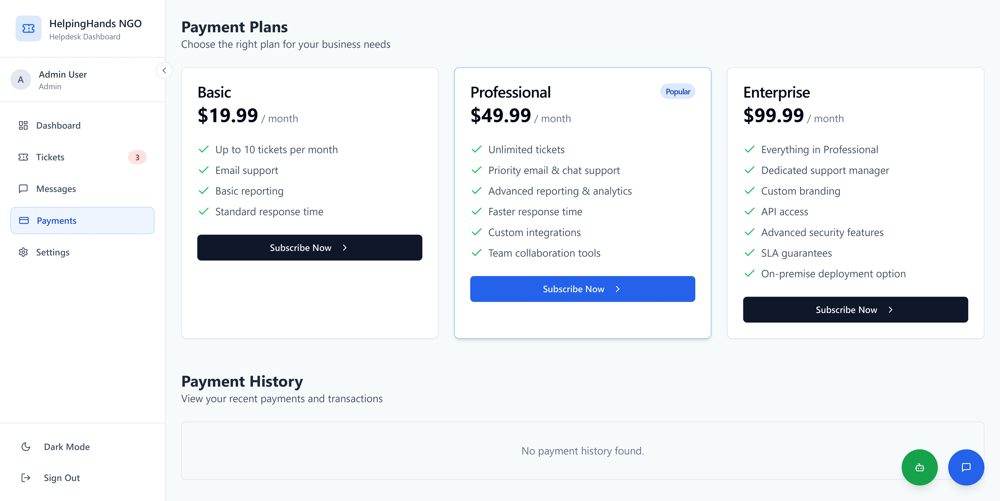
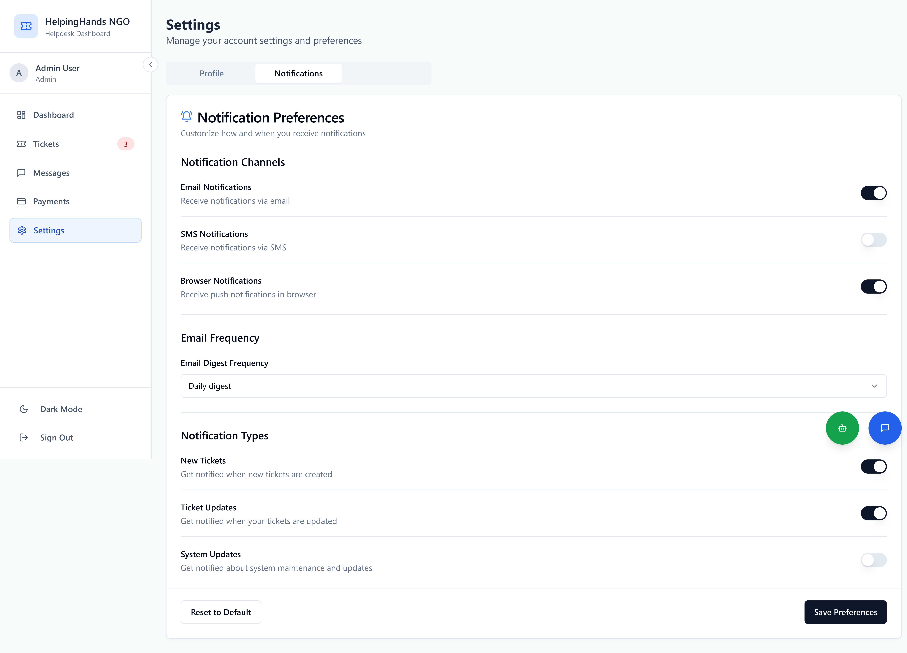

# 🛠️ TechCare Helpdesk

[](LICENSE)
[](https://nodejs.org)
[](https://reactjs.org)
[](https://supabase.com)
[](https://github.com/IsaacZachary/TechCare-Helpdesk)
[](https://github.com/IsaacZachary/TechCare-Helpdesk/commits/main)
[](https://github.com/IsaacZachary/TechCare-Helpdesk/issues)
[](https://github.com/IsaacZachary/TechCare-Helpdesk/pulls)

> **An AI-powered helpdesk and ticketing system** built for African IT support teams and institutions — secure, scalable, and DevOps-ready.

---

## 🌍 Overview

**TechCare Helpdesk** is a modern full-stack system built to streamline IT support and service management across institutions and teams. Powered by Supabase, React, Node.js, and enhanced with AI tooling, it provides real-time issue tracking, role-based dashboards, and modular infrastructure for scaling.

> Developed and maintained by [Isaac Zachary](https://izach.netlify.app) — all rights reserved. Commercial reuse is restricted.

---

## 🖼️ Product Screenshots

Below are some key screenshots of the TechCare Helpdesk platform in action.

| Login Screen | Choose Industry |
|--------------|-----------------|
|  |  |

| Dashboard | Create Ticket |
|-----------|----------------|
|  |  |

| Messages View | Chat Sample |
|---------------|-------------|
|  |  |

| Payments | Notification Settings |
|----------|------------------------|
|  |  |

> 💡 *These UI sections may change as features evolve. More previews coming soon.*

---

---

## 📁 Project Structure

```

TechCare-Helpdesk/
├── client/         # Frontend (React + Vite + Shadcn UI)
├── server/         # Backend (Node.js + Express + Sequelize)
├── db/             # Supabase SQL schemas & scripts
├── docs/           # Diagrams, architecture, usage guides
├── .env.example    # Template for environment variables
└── README.md       # This file

````

---

## 🧪 Tech Stack

| Layer      | Stack |
|------------|-------|
| Frontend   | React, Vite, TailwindCSS, TypeScript, Shadcn UI |
| Backend    | Node.js, Express, Sequelize ORM |
| Database   | Supabase (PostgreSQL + Auth + Storage) |
| Auth       | Supabase Auth (JWT), bcrypt |
| Realtime   | Socket.io |
| Email      | Nodemailer (SMTP via Brevo) |
| AI Tooling | Cursor AI (backend), Lovable AI (frontend) |

---

## ✅ Features

- 🔐 Supabase JWT-based Authentication (User/Admin)
- 🎫 Ticket creation, assignment, status tracking
- 📡 Realtime updates using Socket.io
- 📬 Email notifications via SMTP (Brevo)
- 🧑‍💼 Role-based dashboards for agents, admins, institutions
- 📊 Scalable modular codebase (clean separation)
- ☁️ DevOps-ready (Render + Vercel)
- 🧠 AI-assistant & prompt tools (under development)

---

## 🛣️ Roadmap

- [ ] 🤖 AI Chatbot Assistant (OpenAI, semantic search)
- [ ] 📈 Analytics Dashboard (Graphs, KPIs, SLA trends)
- [ ] 🌍 Multilingual Support (i18n)
- [ ] 📲 M-Pesa SMS alerts & ticket summaries
- [ ] 📤 Ticket export/import (PDF, CSV)
- [ ] 🔐 Supabase RLS rules & team-specific auth
- [ ] 🧑‍💻 Terminal Assistant: AI-driven CLI for helpdesk

---

## ⚙️ Local Setup

### 1. Backend (Node.js)
```bash
cd server
cp ../.env.example .env  # Fill in your Supabase & SMTP info
npm install
npm run dev
````

### 2. Frontend (React)

```bash
cd client
npm install
npm run dev
```

> ℹ️ You must configure Supabase credentials in `.env` for proper connectivity.

---

## 🔐 License & Intellectual Property

This project is released under the [MIT License](LICENSE).
However, **unauthorized reuse, resale, or redistribution of internal code is prohibited**.

TechCare Helpdesk is built with a long-term vision for scale. Commercial licensing and partnership options are available — reach out for collaboration.

---

## 🧠 Built With Purpose

> *“TechCare is for African teams, by an African dreamer — empowering institutions through thoughtful, modern support tools.”*

---

## 💬 Contact

* 🌍 Portfolio: [izach.netlify.app](https://izach.netlify.app)
* 📫 Email: [hello@izach.netlify.app](mailto:hello@izach.netlify.app)
* 🧠 DevOps | AI | TechCare Africa Founder

---

## 🙏 Acknowledgments

* 💡 [Lovable AI](https://lovable.so) — Frontend scaffolding
* 🧠 [Cursor AI](https://cursor.sh) — Backend architecture
* 🌐 [Supabase](https://supabase.com) — Cloud-native database
* 🚀 [Vercel](https://vercel.com) & [Render](https://render.com) — Deployment

---

> Built with vision. Refined with care. Shared with pride.
